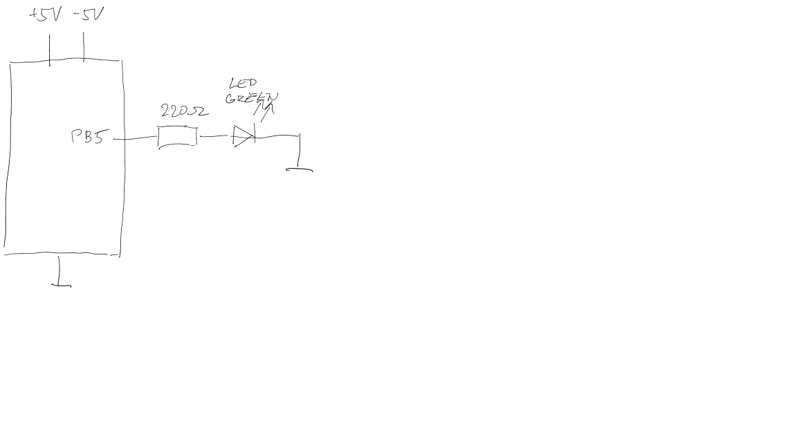

# Lab 1: Michaela Ryšavá

GitHub repository:

   [github.com/xrysav25](https://github.com/xrysav25/Digital_electronics_2)


### Blink example

1. What is the meaning of the following binary operators in C?
   * `|` or
   * `&` and
   * `^` exclusive or
   * `~` negace
   * `<<` left binary shift
   * `>>` right binary shift

2. Complete truth table with operators: `|`, `&`, `^`, `~`

| **b** | **a** |**b or a** | **b and a** | **b xor a** | **not b** |
| :-: | :-: | :-: | :-: | :-: | :-: |
| 0 | 0 | 0 | 0 | 0 | 1 |
| 0 | 1 | 1 | 0 | 1 | 1 |
| 1 | 0 | 1 | 0 | 1 | 0 |
| 1 | 1 | 1 | 1 | 0 | 0 |


### Morse code

1. Listing of C code with syntax highlighting which repeats one "dot" and one "comma" on a LED:

```c
...
#define LED_GREEN   PB5 // AVR pin where green LED is connected
#define SHORT_DELAY 350 // Delay in milliseconds, for break between dots and dashes
#define LONG_DELAY 2000 // for break between letters
#define DOT 200         // dot duration
#define DASH 1000       // dash duration
...

int dot(void)
{
    PORTB = PORTB ^ (1<<LED_GREEN);
    _delay_ms(DOT);
    PORTB = PORTB ^ (1<<LED_GREEN);
    _delay_ms(SHORT_DELAY);
    return 0;
}

int dash(void)
{
    PORTB = PORTB ^ (1<<LED_GREEN); //on
    _delay_ms(DASH);
    PORTB = PORTB ^ (1<<LED_GREEN);
    _delay_ms(SHORT_DELAY);
    return 0;
}

int l_break(void) //between letters
{
    _delay_ms(LONG_DELAY);
    return 0;
}

int main(void)
{
    // Set pin as output in Data Direction Register
    // DDRB = DDRB or 0010 0000
    DDRB = DDRB | (1<<LED_GREEN);

    // Set pin LOW in Data Register (LED off)
    // PORTB = PORTB and 1101 1111
    PORTB = PORTB & ~(1<<LED_GREEN);

    // Infinite loop
    while (1)
    {
        l_break();
        dash();
        dot();
        dot();
        l_break();
        dot();
        l_break();
        dot();
        dot();
        dash();
        dash();
        dash();
        l_break();
    }

    // Will never reach this
    return 0;
}
}
```


2. Scheme of Morse code application, i.e. connection of AVR device, LED, resistor, and supply voltage. The image can be drawn on a computer or by hand. Always name all components and their values!

   
