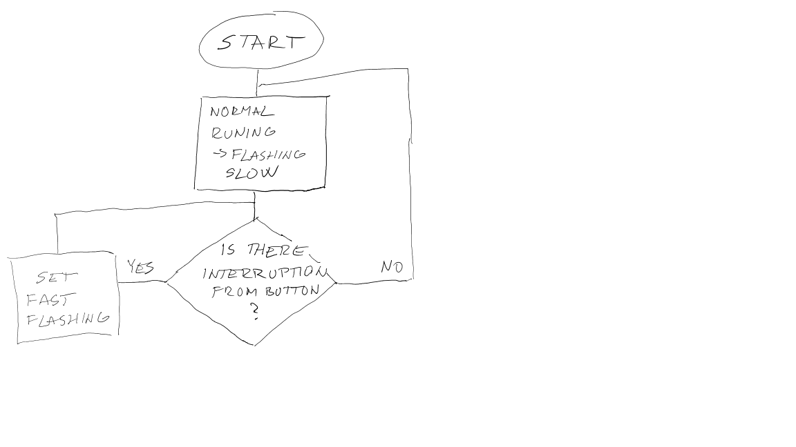
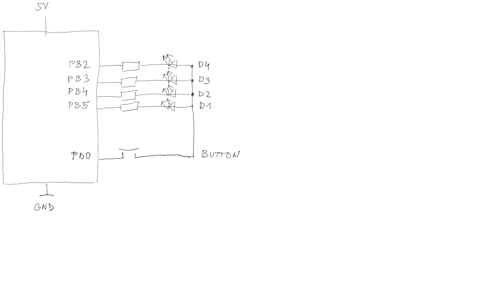

# Lab 4: YOUR_FIRSTNAME FAMILYNAME

Link to your `Digital-electronics-2` GitHub repository:

   [https://github.com/xrysav25/Digital_electronics_2](https://github.com/xrysav25/Digital_electronics_2)


### Overflow times

1. Complete table with overflow times.

| **Module** | **Number of bits** | **1** | **8** | **32** | **64** | **128** | **256** | **1024** |
| :-: | :-: | :-: | :-: | :-: | :-: | :-: | :-: | :-: |
| Timer/Counter0 | 8 | 16u | 128u | -- | 1024u | -- | 4096u | 16384u |
| Timer/Counter1 | 16 | 4096u | 32.768m | -- | 262.14m | -- | 1049.6m| 4194.3m |
| Timer/Counter2 | 8 | 16u | 128u | 512u | 1024u | 2048u | 4096u| 16384u |


### Timer library

1. In your words, describe the difference between common C function and interrupt service routine.
   * Function needs calling to perform itself. If we want to use it for checking some event, we need great amount of calling and checking if "now" or not.
   * Interrupt service routine is perfect for event reactions, because it determine an exception from normal rune. It's perfect for key detection for example.

2. Part of the header file listing with syntax highlighting, which defines settings for Timer/Counter0:

```c
/**
 * @name  Definitions for 8-bit Timer/Counter0
 * @note  t_OVF = 1/F_CPU * prescaler * 2^n where n = 8, F_CPU = 16 MHz
 */
// WRITE YOUR CODE HERE
#define TIM0_stop()							TCCR0B &= ~((1<<CS02) | (1<<CS01) | (1<<CS00));
/** @brief Set overflow 16us, prescaler 001 --> 1 */
#define TIM0_overflow_16us()				TCCR0B &= ~((1<<CS02) | (1<<CS01)); TCCR0B |= (1<<CS00);
/** @brief Set overflow 128us, prescaler 010 --> 8 */
#define TIM0_overflow_128us()				TCCR0B &= ~((1<<CS02) | (1<<CS00)); TCCR0B |= (1<<CS01);
/** @brief Set overflow 1ms, prescaler 011 --> 64 */
#define TIM0_overflow_1ms()					TCCR0B &= ~(1<<CS02); TCCR0B |= (1<<CS01) | (1<<CS00);
/** @brief Set overflow 4ms, prescaler 100 --> 256 */
#define TIM0_overflow_4ms()					TCCR0B &= ~((1<<CS01) | (1<<CS00)); TCCR0B |= (1<<CS02);
/** @brief Set overflow 16ms, prescaler // 101 --> 1024 */
#define TIM0_overflow_16ms()				TCCR0B &= ~(1<<CS01); TCCR0B |= (1<<CS02) | (1<<CS00);
/** @brief Enable overflow interrupt, 1 --> enable */
#define TIM0_overflow_interrupt_enable()	TIMSK0 |= (1<<TOIE0);
/** @brief Disable overflow interrupt, 0 --> disable */
#define TIM0_overflow_interrupt_disable()	TIMSK0 &= ~(1<<TOIE0);
```

3. Flowchart figure for function `main()` and interrupt service routine `ISR(TIMER1_OVF_vect)` of application that ensures the flashing of one LED in the timer interruption. When the button is pressed, the blinking is faster, when the button is released, it is slower. Use only a timer overflow and not a delay library. The image can be drawn on a computer or by hand. Use clear descriptions of the individual steps of the algorithms.

   


### Knight Rider

1. Scheme of Knight Rider application with four LEDs and a push button, connected according to Multi-function shield. Connect AVR device, LEDs, resistors, push button, and supply voltage. The image can be drawn on a computer or by hand. Always name all components and their values.

   
